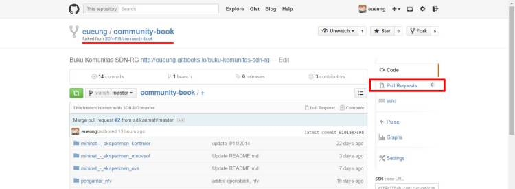
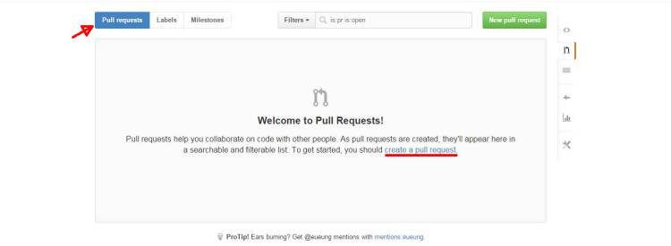
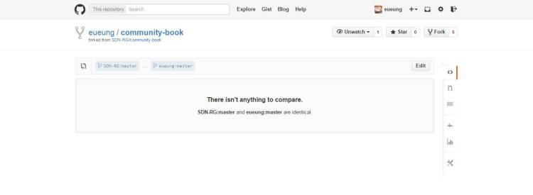
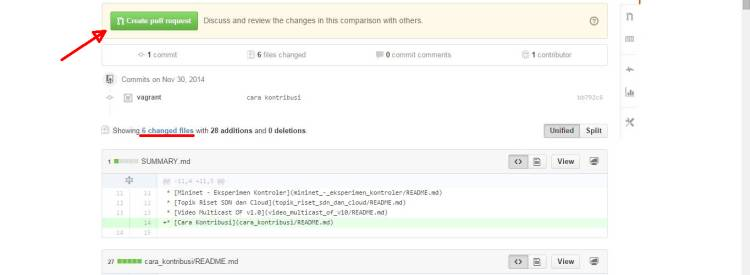
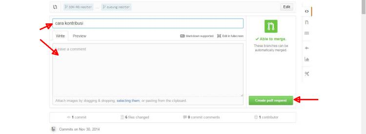
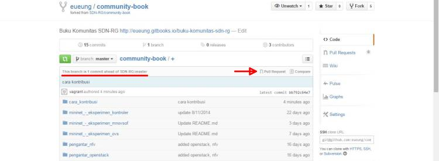

# Cara Kontribusi

Seperti tersurat dalam namanya, *Buku Komunitas SDN-RG* bersifat open-source untuk *open-contribution*. Untuk yg belum terbiasa dengan git & github, berikut langkah-langkah kontribusi secara garis besar.

1. Masuk ke akun github anda! Kalau belum punya, daftar via https://github.com/join
2. Kunjungi repo buku komunitas di
   https://github.com/SDN-RG/community-book
3. **Fork** (seperti ilustrasi di bawah)

   

4. Perhatikan petunjuk dengan garis merah. Setelah operasi fork selesai, tampilan kurang-lebih seperti berikut.

   

5. Lakukan **Pull Request** (PR), apabila anda sudah selesai dan siap untuk integrasi.

  

  kalau anda langsung coba tanpa melakukan apa-apa, hasilnya spt berikut:

  

  kalau sudah ada commit baru:

  

  

  status dan interface PR di forked-repo:

  

##Editor
Walaupun bisa dilakukan manual dengan sembarang text-editor, akan lebih mudah untuk menulis dan melakukan *preview* melalui editor gitbook. Unduh editor untuk sistem operasi yg sesuai di

> https://github.com/GitbookIO/editor/releases
