# Mininet - Eksperimen Kontroler

*Erlangga Ervansyah, TBA*

##Reference Controller

- **Buat topologi di mininet**

  `root@ubuntu:~#mn --topo single,3 --mac --switch ovsk`

 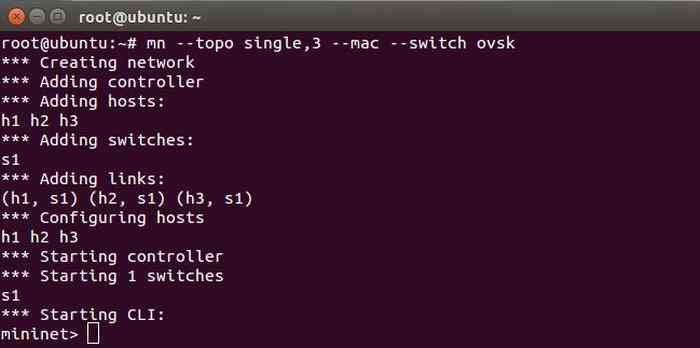

 >Melalui perintah diatas, Mininet memproses topologi dengan komposisi sebagai berikut:
>- 1 node controller referensional (c0)
>- 3 buah node host (h1,h2,h3)
>- 1 buah node switch open vswitch (s1)

- **Melihat informasi node di topologi**

  `mininet> dump`

 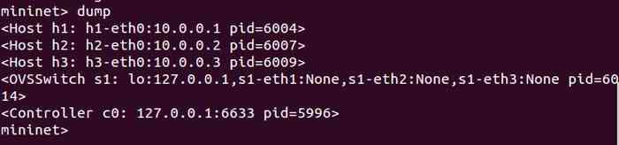

 > Dari command dump, didapatkan informasi *ip address* dan *pid number* untuk masing-masing node

- **Melihat interaksi antar node di topologi**

  `mininet> net`

 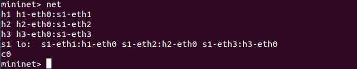

 > Dari command net, didapat informasi hubungan antar host dan switch. Diperoleh gambaran topology sebagai berikut (*"SDN by Ken Gray & Thomas D. Nadeau"*) :

 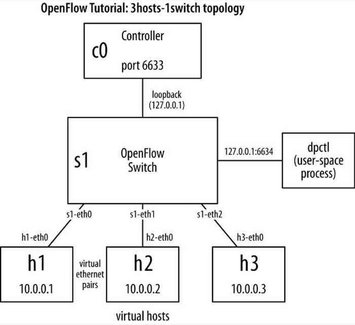

- **Tes koneksi antar host**

    `mininet> h1 ping -c 3 h2` atau
    `mininet> pingall`

 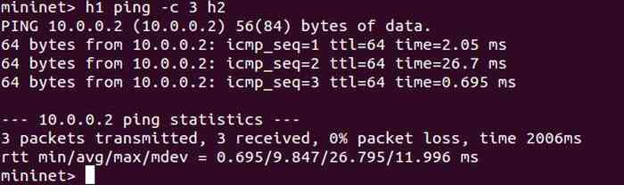

 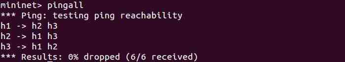

 > Command ping (h1 ping h2) berguna untuk mengecek koneksi antar host, adapun atribut -c untuk menentukan jumlah paket yang akan dikirimkan untuk inisiasi
 >
 > Command pingall untuk *generate* tes koneksi semua host yang terhubung

- **Melihat informasi paket di wireshark**

  buka terminal baru / remote ke host mininet: `root@ubuntu:~#wireshark`

 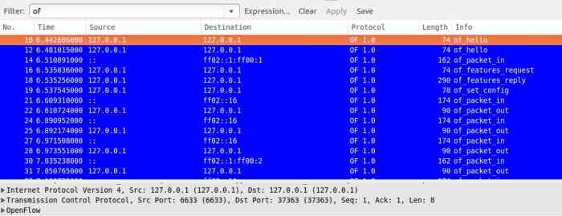

 > Proses wireshark diatas di *capture* ketika mininet sedang memproses topologi baru

 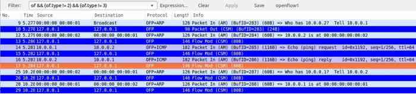

 > Proses wireshark diatas di *capture* saat host h1 melakukan icmp ping ke host h2 (controller reference)

Berikut skema *sequence diagram* untuk topologi (Controller Referensional)

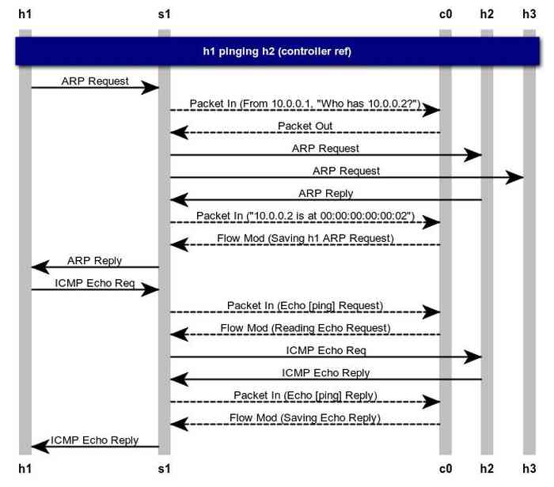

##POX Controller

- **Aktifkan controller POX**

  `root@ubuntu:~# cd /pox`
  `root@ubuntu:~/pox# ./pox.py log.level --DEBUG misc.of_tutorial`

  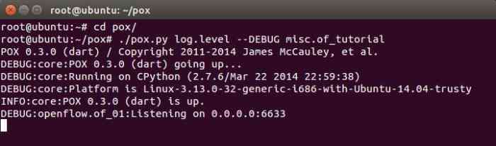

  atau

 `root@ubuntu:~/pox# python ./pox.py forwarding.l2_learning`

 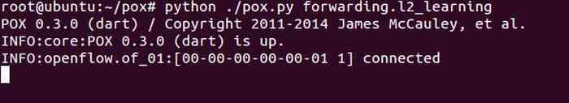

 > Perbedaan kedua command diatas :
> 1. Command pertama (log.level --DEBUG misc.of_tutorial) saat proses controller di terminal dimatikan maka proses controller di mininet juga langsung mati
> 2. Command kedua (forwarding.l2_learning) saat proses controller di terminal dimatikan, proses controller di mininet tidak langsung mati. Proses masih tetap berjalan namun setelah beberapa detik (sekitar 8 detik) proses controller mati.

- **Buat topologi di mininet**

   `root@ubuntu:~# mn --topo single,3 --mac --switch ovsk controller=remote`

 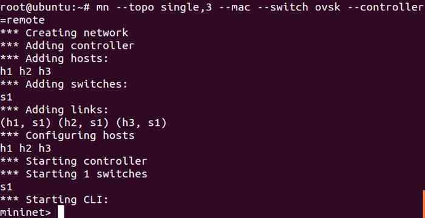

 > Controller bisa diberikan ip secara manual dengan menyisipkan beberapa informasi seperti contoh berikut :
> "- -controller=remote,ip=10.0.0.10,port=6633"

- **Melihat informasi paket di wireshark**

  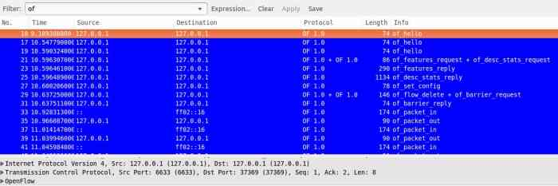

 >Proses wireshark diatas di *capture* saat membuat topologi di mininet

 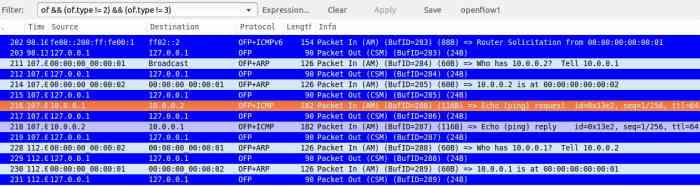

 >Proses wireshark diatas di *capture* saat host h1 melakukan icmp ping ke host h2 (controller pox misc.of_tutorial)

 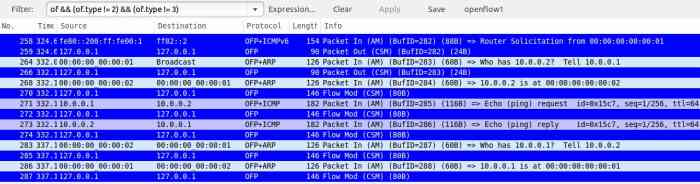

 >Proses wireshark diatas di *capture* saat host h1 melakukan icmp ping ke host h2 (controller pox forwarding.l2_learning)

- **Sequence diagram untuk topologi controller menggunakan POX**

 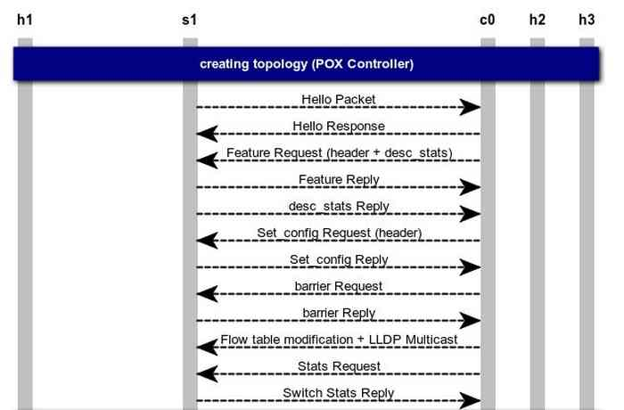

 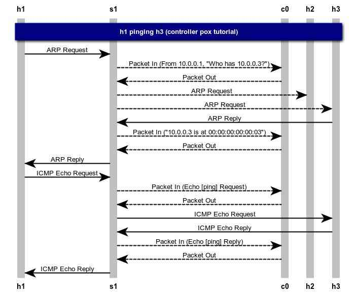

 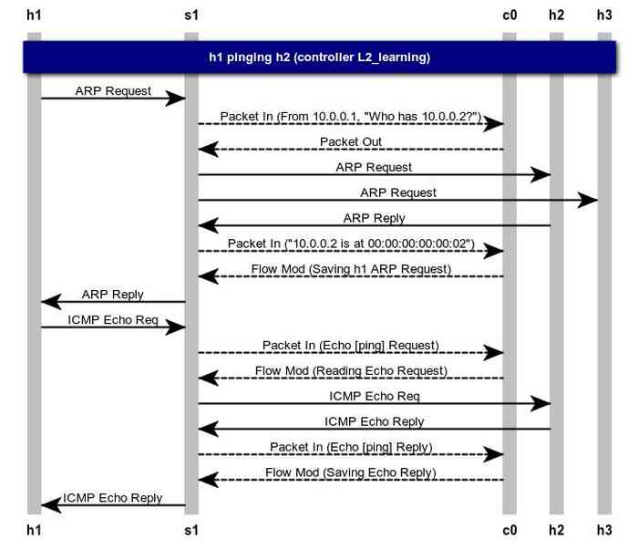

- **Analisis wireshark di kedua Controller**
 >Berdasarkan kedua gambar wireshark diatas, terdapat perbedaan antara Controller referensional dan Controller POX.
 >
 > Wireshark pada *controller reference*, setiap paket tercantum satu informasi. Sedangkan pada Controller POX, setiap paket diantaranya terdapat lebih dari satu informasi, contohnya paket no. 21 dan 29
 >
 >  Pada proses ping antar dua host, pada *controller pox* (of_tutorial) tidak terdapat paket *FlowMod* yang lewat karena program ini dijalankan bertindak sebagai hub
 >  Sedangkan untuk *controller reference* dan pox (l2_learning) ada paket *FlowMod* yang lewat karena program ini dijalankan agar bertindak sebagai switch
 >
 >  Selain proses ini, perlakuan tiap controller masih relatif sama

##Referensi

1. TBA
2. ...

##Lisensi
*CC Attribution-NonCommercial-NoDerivatives*
[(Lisensi)](http://creativecommons.org/licenses/by-nc-nd/4.0/)
