# Mininet - Eksperimen Topologi

*Dwina Fitriyandini Siswanto, Siti Amatullah Karimah*

Pada Mininet sudah terdapat beberapa topologi bawaan yang dapat langsung digunakan dengan menggunakan perintah (*command*) tertentu. Beberapa topologi bawaan tersebut antara lain topologi *single*, *tree* dan *linear*.

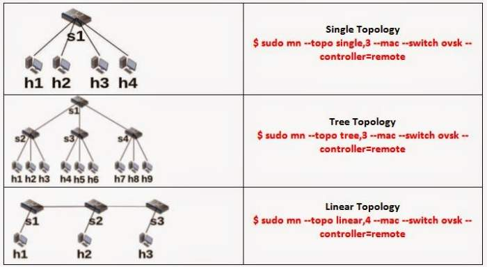

Pada eksperimen ini dilakukan pembangunan topologi diluar ketiga topologi diatas atau bisa disebut dengan topologi bebas atau *custom topology*.

## Topologi Bebas (*Custom Topo*)
Membuat *custom topology* dapat dilakukan dengan 2 cara, yaitu secara manual dengan menulis kode python atau membuat konfigurasi topologi menggunakan GUI editor seperti *Virtual Network Description* (vnd) kemudian diexport ke bentuk *file* yang dapat di-*running* oleh mininet.

- Membuat custom topology manual pada mininet
   1. Buatlah file *.py* dari topologi yang diinginkan kemudian simpan di folder *mininet/custom/*
   2. Setelah membuat file *.py* kemudian *run* *custom topology* yang telah dibuat menggunakan *command* :
`$ sudo mn --custom <custom_topology> --topo mytopo --mac --switch ovsk --controller remote`


- Membuat *custom topology* dengan vnd pada via situs http://www.ramonfontes.com/vnd/
  1. Buatlah topologi yang diinginkan
  2. Klik ***File*>*Export*>*Export to mininet***, kemudian ubah format file menjadi .py
  3. Pada mininet, *copy* file ke dalam folder *mininet/examples*
  4. Buat agar file vnd dapat dieksekusi oleh mininet dengan
     `$ chmod +x <file_topology_vnd>`
  5. Jalankan file menggunakan command
	`$ sudo ./<file_topology_vnd>`

Ketika membuat *custom topology* pada vnd, terdapat beberapa fitur pendefinisian yang dibawa oleh vnd. Diantaranya sebagai berikut :

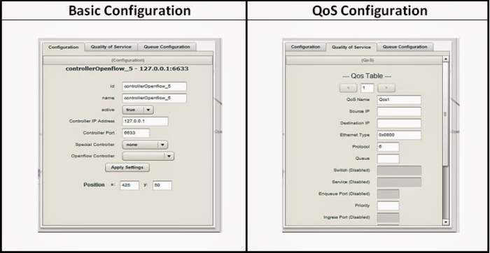

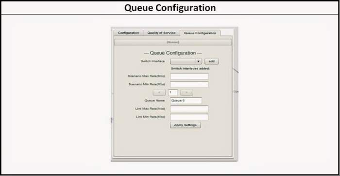

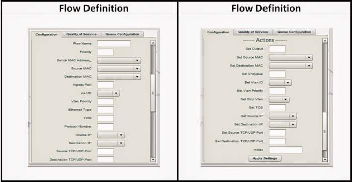


## Menjalankan POX Controller
Sebelum menjalankan *custom topology* jalankan *controller* yang digunakan. Pada eksperimen ini *controller* yang digunakan ialah POX controller.

Berikut contoh cara menjalankan POX controller dalam mininet:
```bash
cd /home/ubuntu/pox && ./pox.py log.level --DEBUG forwarding.tutorial_I2_hub
```

## Eksperimen Custom Topology
Pada eksperimen ini dibuat 5 *custom topology* yang masing-masingnya dibangun menggunakan 2 cara yang dijelaskan sebelumnya yakni secara manual dan juga mengunakan vnd. Berikut 5 jenis topologi yang dibangun,

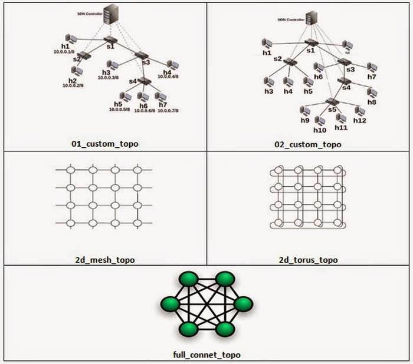


**1. 01_custom_topo**


- Menjalankan custom topology yang telah dibuat di mininet

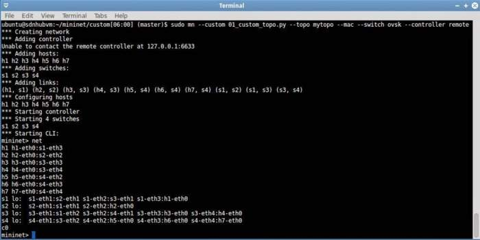

- Menjalankan custom topology yang telah dibuat di vnd

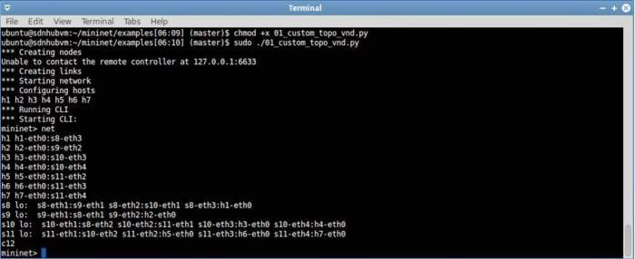


**2.	02_custom_topo**

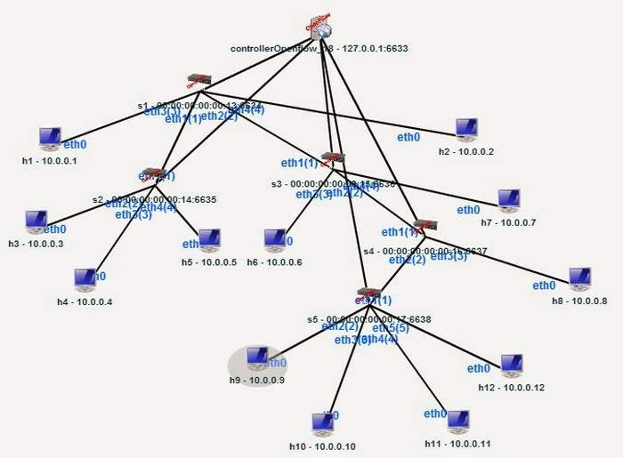

**3.	2d_mesh_topo**

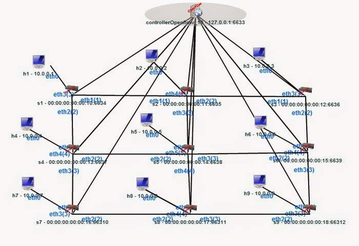

**4. 2d_torus_topo**

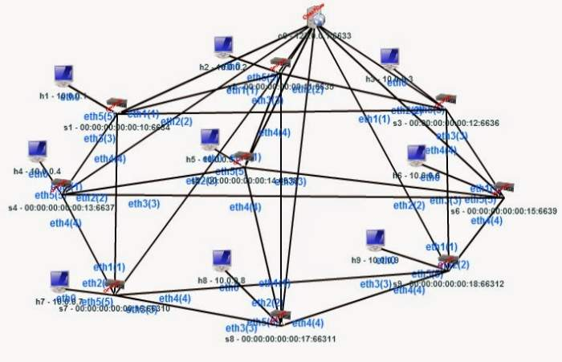

**5. full_connect_topo**

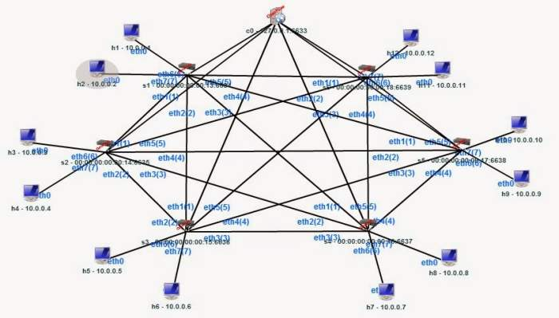

**Penjelasan Source Code Mininet Topology**

Berikut ini sedikit penjelasan mengenai *source code* pembentukan topologi pada mininet, berdasarkan topologi yang di *generate* oleh vnd.


Baris pertama diawali dengan simbol #! yang diikuti oleh *pathname* (/usr/bin/python) dari Python *interpreter* agar *script* Python dapat dieksekusi oleh sistem operasi Unix.

'*Statement from'* pada Python memungkinkan kita meng-*import* atribut secara spesifik dari modul kedalam *namespace* yang digunakan.


def topology() : merupakan sintaks yang digunakan untuk mendefinisikan fungsi ‘topology’ dimana pada akhir namespace, fungsi ini dipanggil melalui sintaks ‘topology()’.
 
net = Mininet ( controller=RemoteController, link=TCLink, switch=OVSkernelSwitch )

•**controller=RemoteController**
Mendefinisikan controller yang di kontrol diluar Mininet.

•**link=TCLink**
Menspesifikasikan link sebagai TC yang digunakan untuk memodifikasi parameter link.

•**switch=OVSkernelSwitch**
Penggunaan OVS (Open v Switch) untuk menyediakan fungsi switching pada lingkungan virtualisasi hardware dan juga mendukung berbagai macam protokol standar pada jaringan komputer.


Setelah jaringan dibentuk, perintah 'start()' digunakan untuk menjalankannya. Kemudian sistem dapat menjalankan beberapa *task* yang berguna diantaranya melakukan tes *basic connectivity*, *bandwidth test* dan juga menjalankan mininet CLI.

Metode 'net.stop()' dipanggil untuk melakukan *shut down* pada jaringan setelah seluruh tes atau aktivitas yang diinginkan dijalankan.

##Referensi

1. TBA
2. ...

##Lisensi
*CC Attribution-NonCommercial-NoDerivatives*
[(Lisensi)](http://creativecommons.org/licenses/by-nc-nd/4.0/)
