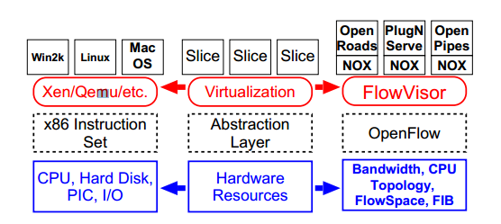

# FlowVisor

Seperti halnya dengan lapisan virtualisasi pada komputer, FlowVisor berada diantara lapisan fisik perangkat keras jaringan dan perangkat lunak yang mengontrolnya. Begitu juga dengan sistem operasi yang menggunakan sekumpulan instruksi untuk mengontrol perangkat keras yang ada dibawahnya, FlowVisor menggunakan OpenFlow untuk mengontrol perangkat jaringan yang ada dibawahnya karena dengan OpenFlow mengekspose paket-paket control forwarding dari switch untuk entitas terprogram (programmable entity) seperti OpenFlow Controller.

FlowVisor dapat digambarkan sebagai OpenFlow controller dengan spesial fungsi yaitu dijadikan sebagai transparent proxy antara OpenFlow Switch dan beberapa OpenFlow Controller. Kemudian FlowVisor akan membuat potongan (slices) yang lengkap dari sebuah resource jaringan dan memberikan potongan-potongan tersebut ke controller yang berbeda-beda. Potongan-potongan tersebut dapat didefinisikan dengan berbagai macam kombinasi port dari switch (layer 1), asal/tujuan dari alamat atau type ethernet (layer 2), asal/tujuan dari alamat IP atau type (layer 3), dan asal/tujuan dari alamat port TCP/UDP atau ICMP code/type (layer 4). Sekumpulan dari definisi ini bisa disebut sebagai "FlowSpace" dari spesifik potongan (slice) tersebut.

Salah satu pentingnya fungsi dari FlowVisor yaitu memaksa setiap potongan (slice) tersebut terisolasi, sehingga tidak bisa saling mempengaruhi seperti controller dari slice satu tidak bisa mengontrol trafik dari slice yang lainnya.

1. [FlowVisor: A Network Virtualization Layer](http://archive.openflow.org/downloads/technicalreports/openflow-tr-2009-1-flowvisor.pdf), OpenFlow Consortium, October, 2009
2. [FlowVisor Wiki](https://github.com/OPENNETWORKINGLAB/flowvisor/wiki), OpenNetworkingLab, June, 2013
