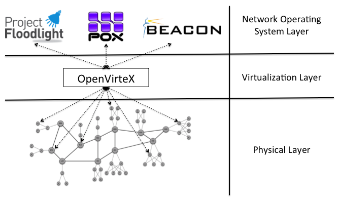

# OpenVirtex (OVX)

Seperti halnya dengan FlowVisor, OpenVirtex juga merupakan platform virtualisasi jaringan yang mengijinkan untuk melakukan pengaturan topologi jaringan dan pengalamatan yang unik dengan tetap memberikan kontrol penuh dari jaringan virtual yang berbasiskan OpenFlow. Pada intinya, teknologi ini ingin memperkenalkan sebuah konsep baru yaitu jaringan virtual yang terprogram (Programmable Virtual Network).

OVX juga berada diantara perangkat keras fisik yang ada dibawahnya dan controller jaringan virtual, yang pada akhirnya akan memberikan:

- kemampuan untuk membuat jaringan virtual yang terisolasi dengan topologi yang spesikasi khusus
- kemungkinan membangun Network Operating System
- kemampuan menggunakan seluruh ruang pengalamatan (address space)
- kemampuan mengubah topologi jaringan yang sedang beroperasi
- kemungkinan melakukan recover dari failure fisik

1. [OpenVirtex: Programmable Virtual Networks](http://ovx.onlab.us/), ONLAB US, December, 2014
