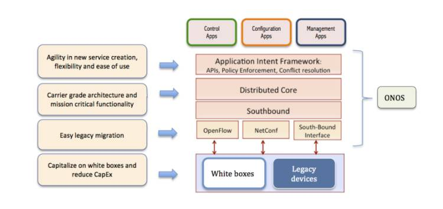
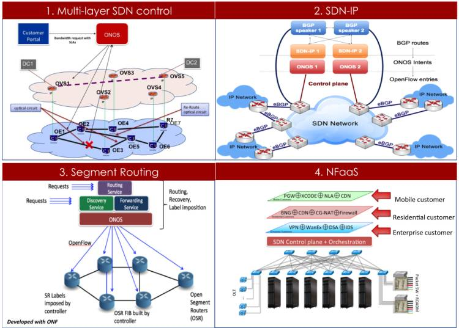

# Open Network OS - ONOS

*Eueung Mulyana*

ONOS (*Open Network Operating System*) merupakan sistem operasi jaringan SDN yg terbuka (open source), ditujukan terutama untuk jaringan operator. ONOS diprakarsai dan dibuat oleh ON.Lab dengan kerja-sama lintas sektor, baik operator, vendor maupun universitas. ONOS baru (akan) diluncurkan ke publik tanggal 5 Desember 2014.

##ONOS dan Operator
ONOS diperkenalkan sebagai OS jaringan SDN yg multi-entitas dan terdistribusi, serta dirancang untuk HA, kinerja tinggi, skalabitas dan abstraksi NB/SB yg konsisten (dan semakin baik).

Atribut kunci yg (katanya) membuat ONOS cocok untuk jaringan operator, adalah:
- **NB**: Menyediakan "Application Intent Framework" sebagai NBI untuk aplikasi. AIF adalah framework (*policy-driven*) yg dapat digunakan oleh devs/ops sebagai bahasa high-level tanpa harus dipusingkan dengan bagaimana implementasinya di jaringan
- **NB**: Menyediakan informasi struktur (graph) seluruh jaringan sebagai bagian dari abstraksi NB
- **Core**: Sistem terdistribusi dengan implikasi HA, HP dan scale-out
- **SB**: Menyediakan abstraksi SB untuk *discovery*, konfigurasi dan *programmability*; mendukung OF dan sejumlah interface/divais lainnya

##Use Cases
Contoh penggunaan ONOS di operator:
- Kontrol dan optimasi jaringan core optik via SDN secara multi-layer
- Implementasi jaringan hibrid SDN-IP dengan peering transparan antar (*pulau*) SDN dan (*pulau*) IP/Internet
- NFaaS (*Network Function as a Service*), salah satu pendekatan NFV yg skalabel, fleksibel dan intuitif
- Segment Routing (WAN-based)

##Referensi

1. [ONOS - An Experimental Open-Source Distributed SDN OS](https://wiki.opendaylight.org/images/d/dc/ONOS_ODL_TechTalkv7.pptx), ON.LAB/ONRC, September, 2013
2. [SDN Adoption in Service Provider Networks](http://onosproject.org/wp-content/uploads/2014/11/Whitepaper-Service-Provider-SDN-final.pdf), ON.LAB/ONRC, November, 2014

##Lisensi
*CC Attribution-NonCommercial-NoDerivatives*
[(Lisensi)](http://creativecommons.org/licenses/by-nc-nd/4.0/)
