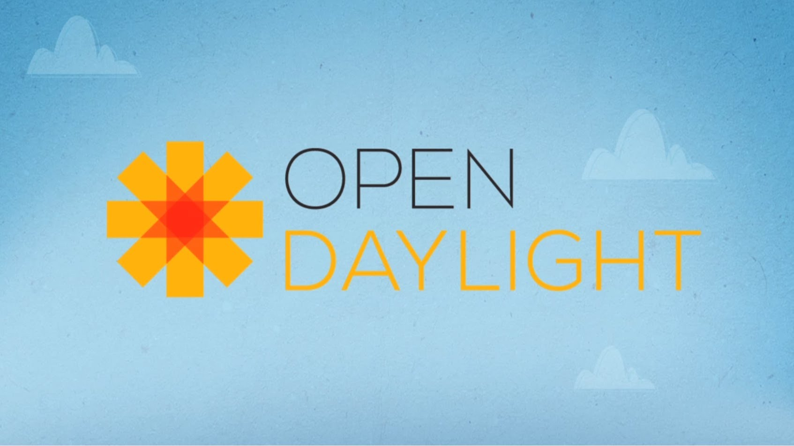
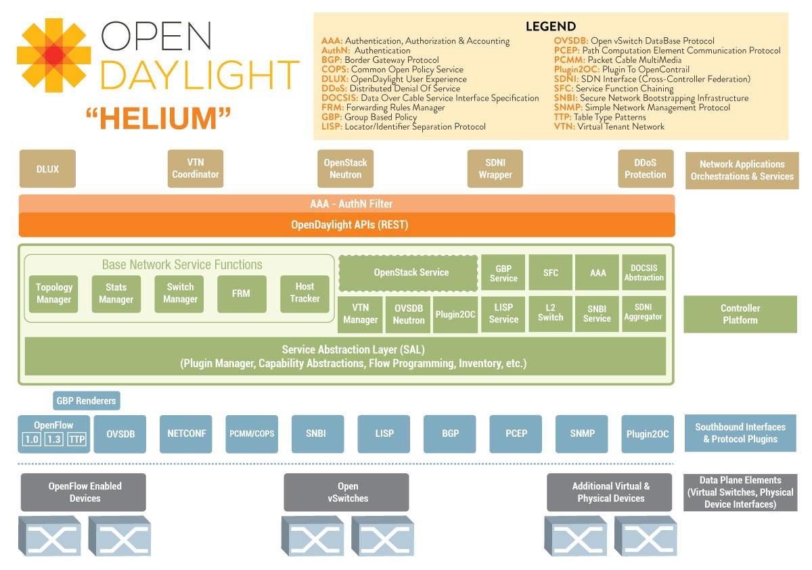

# The OpenDaylight Project

OpenDaylight Project adalah sebuah proyek *open source* kolaboratif di Linux Foundation yang bertujuan untuk mempercepat adopsi *Software-Defined Networking* (SDN) dan menciptakan pondasi yang solid untuk *Network Function Virtualization* (NFV) dengan pendekatan yang lebih transparan untuk mendorong inovasi baru dan mengurangi risiko. Linux Foundation Collaborative Projects sendiri merupakan proyek perangkat lunak didanai secara independen yang bertujuan untuk memanfaatkan kekuatan pengembangan kolaboratif untuk bahan bakar inovasi di industri dan ekosistem.

OpenDaylight Project didirikan oleh para pemimpin industri jaringan pada 8 April 2013 dan terbuka untuk semua pihak. Komunitas OpenDaylight mengembangkan kerangka SDN yang umum dan terbuka, terdiri dari berbagai kode dan cetak biru.

OpenDaylight didukung oleh banyak vendor jaringan ternama di dunia, diantaranya Microsoft, IBM, Cisco, Huawei, Ericsson, dan lain-lain. Vendor-vendor yang berkontribusi pada OpenDaylight Project terbagi atas Platinum, Gold, dan Silver Members bergantung pada besar kontribusinya. Beberapa proyek yang termasuk pada OpenDaylight Project yaitu OpenDaylight Controller, OpenDaylight *Virtual Tenant Network* (VTN), Open DOVE, OSCP Project, YANG Tools, LISP Flow Mapping, OVSDB (Open vSwitch Database), dan dlux (openDayLight User eXperience) [5].

## OpenDaylight Controller
OpenDaylight Controller adalah sebuah proyek open source dengan *Controller platform* yang *modular*, *pluggable*, dan fleksibel. Kontroler ini diimplementasikan pada perangkat lunak dan ditampung dalam *Java Virtual Machine* (JVM)-nya sendiri. Dengan demikian, OpenDaylight dapat digunakan pada perangkat keras dan *platform* sistem operasi apapun yang mendukung Java.

OpenDaylight mengekspos *open northbound API* yang digunakan oleh aplikasi. OpenDaylight mendukung kerangka OSGi dan *bidirectional REST* untuk *northbound API*. Kerangka OSGi digunakan untuk aplikasi yang akan berjalan di address space yang sama dengan kontroler sementara REST (web based) API digunakan untuk aplikasi yang tidak berjalan di *address space* yang sama (atau bahkan tidak pada mesin yang sama) dengan kontroler. Algoritma dan logika bisnis berada pada aplikasi. Aplikasi ini menggunakan kontroler untuk mengumpulkan data jaringan, menjalankan algoritma analisis, dan kemudian menggunakan kontroler untuk menerapkan aturan baru, jika ada, ke seluruh jaringan.

*Southbound interface* mampu mendukung beberapa protokol (sebagai plugin terpisah), misalnya OpenFlow 1.0, OpenFlow 1.3, BGP-LS, dll Modul ini terhubung secara dinamis ke dalam *Service Abstraction Layer* (SAL). SAL mengekspos layanan perangkat dengan modul sisi “utara”. SAL juga menentukan bagaimana memenuhi permintaan layanan terlepas dari protokol yang dipakai antara kontroler dengan perangkat jaringan [6].

OpenDaylight Controller dinamai berdasarkan nama-nama elemen pada tabel periodik. Versi pertama dari OpenDaylight yaitu Hydrogen dirilis 10 bulan setelah OpenDaylight Project didirikan. Sekarang, versi kedua yang diberi nama Helium telah beredar dengan menawarkan perbaikan-perbaikan berupa [7]:
* Peningkatan clustering dan high-availability support untuk kontroler inti.
* Akuntansi, otorisasi dan autentikasi untuk peningkatan keamanan.
* Antarmuka pengguna yang baru, yaitu dlux (the openDayLight User eXperience), yang dapat berjalan terpisah dari perangkat lunak OpenDaylight selama ada koneksi IP.
* Dukungan untuk Apache Karaf container, sehingga memungkinkan operator jaringan untuk menyesuaikan instalasi, hanya menggunakan fitur yang mereka perlukan.
* Integrasi lebih dalam dengan OpenStack, termasuk perbaikan yang signifikan terhadap proyek Open vSwitch Database (OVSDB), dan pratinjau teknologi fitur OpenStack seperti Security Group, Distributed Virtual Router dan Load Balancing-as-a-Service.

