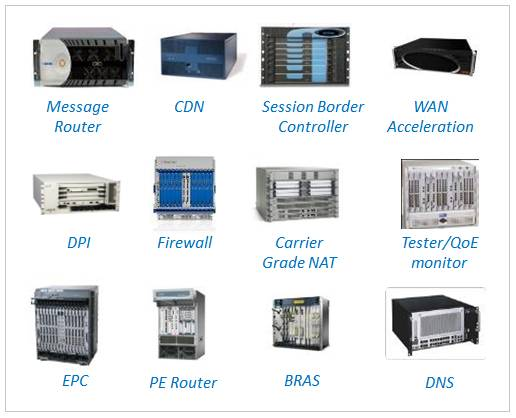
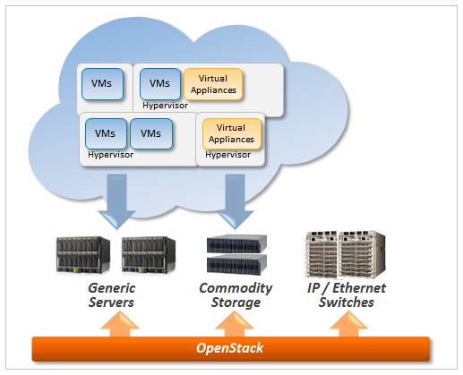

# Pengantar NFV

*Eueung Mulyana*

Konsep **NFV** (*Network Functions Virtualization*) berawal dari para operator/telco yg mencari jalan untuk mempercepat implementasi layanan baru jaringan untuk mendukung strategi bisnis dan pertumbuhan pendapatan mereka. Salah-satu hambatan  signifikan yg mereka rasakan adalah ketergantungan terhadap *hardware-based appliance*.

##Pra NFV
Pada jaringan operator *tradisional*, setiap fungsi (jaringan) spesifik biasanya dilakukan oleh *appliance* dengan perangkat keras *proprietary*. Software dan hardware dalam appliance (sengaja dibuat) tidak bisa dipisahkan dan tergantung satu sama lain.

Contoh dari appliance yg dimaksud antara lain adalah: perangkat DPI (*Deep Packet Inspection*), CDN (*Content Distribution Network*) Appliance, Router, Firewall, Load-Balancer, NAT (*Network Address Translators*), Session Border Controller, Mobile Base Station Controller, Mobile Packet Gateway, DNS (*Domain Name System*) dll.

##Inisiatif NFV
Ketika banyak orang sudah sangat terbiasa dengan server virtual, kemudian mulai ada yg mempertanyakan: mengapa *Network Function* (NF) harus masih tergantung pada hardware tertentu? Bukankah, apabila NF dapat berjalan pada perangkat yg lumrah dan mudah didapat (i.e. *commodity hardware*), implementasi NF pada jaringan akan lebih cepat, mudah dan murah?

NFV adalah konsep yg dimunculkan untuk membuat NF yg dapat diimplementasikan seluruhnya secara software, dan kemudian untuk dijalankan pada *industry-standard* hardware. Secara umum, *industry-standard* hardware menunjuk pada server-server umum (e.g. Intel x86) yg tersedia di pasar beserta kelengkapannya (e.g. switch ethernet standard).

Dengan konsep ini, sebuah NF (e.g. *Session Border Controller*) dapat didistribusikan ke operator (hanya) sebagai software. Yg perlu dilakukan oleh operator ini, hanyalah melakukan prosedur instalasi pada infrastruktur data-center mereka (cukup dengan  perangkat standard e.g. *rack-mounted* / *blade-server* yg saling terhubung dengan switch ethernet).

##Physical vs. Virtual NF
Keterbatasan NF secara fisik:
- *Fragmented non-commodity HW*
- Instalasi fisik per appliance per site
- Utilisasi aset rendah
- Pengembangan HW relatif lambat dan sulit dilakukan proses  kontinu (*deploy*, *upgrade*, etc.)
- Untuk pemain baru, *barrier-to-entry* untuk pengembangan HW relatif lebih sulit
- Keterbatasan lain (pemilihan vendor, fitur modularitas, dll.)

Keuntungan NF virtual (NFV):
- *Flexible*, *extensible*
- Utilisasi aset tinggi
- Dapat melakukan proses kontinu (*deploy*, *upgrade*)
- Modular
- Kondusif untuk iklim kompetisi, *barrier-to-entry* relatif lebih rendah
- Ekosistem inovatif

##TL;DR - NFV
- Fungsi jaringan (NF) secara (*pure*) software
- Memisahkan / menghilangkan ketergantungan NF terhadap perangkat proprietary
- Menggunakan teknologi virtualisasi standard
- Dapat berjalan pada *commodity* / *industry-standard* hardware

:-D

##Referensi

1. [What is NFV?](https://www.sdncentral.com/whats-network-functions-virtualization-nfv/), SDNcentral
2. [A Guide to NFV and SDN](http://www...), Martin Taylor, Metaswitch Networks, 2014
3. [Utilizing OpenStack to Meet Telco Needs](http://www...), Toby Ford (AT&T), Mats Karlsson (Ericsson), 2014
4. [SDN and NFV for Carriers](http://www...),MP Odini (HP), 2013

##Lisensi
*CC Attribution-NonCommercial-NoDerivatives*
[(Lisensi)](http://creativecommons.org/licenses/by-nc-nd/4.0/)
