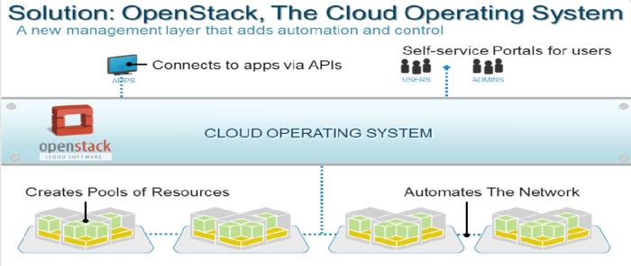
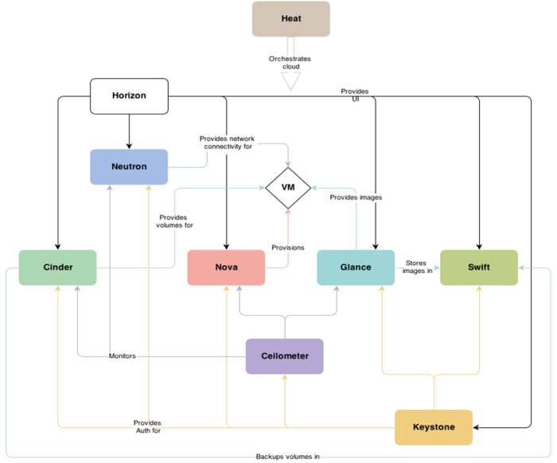

# Pengantar OpenStack

*Ady Saputra, Adrie Taniwidjaja & Eueung Mulyana*

OpenStack merupakan platform perangkat lunak untuk cloud, baik publik maupun privat. Inisiatif OpenStack dimulai tahun 2010 oleh Rackspace dan NASA. Relatif muda dibandingkan dengan beberapa inisiatif cloud lain seperti CloudStack atau OpenNebula.

##Definisi
OpenStack adalah sistem operasi cloud yg mengelola sumber-daya a.l. komputasi, penyimpan dan jaringan, yg tersedia pada infrastruktur fisik seperti dalam sebuah fasilitas pusat-data (*data-center*). Admin atau pengguna dapat mengendalikan dan melakukan *provisioning* atas sumber-daya ini melalui *dashboard* / antar-muka web. Developer dapat mengakses sumber-daya tersebut melalui sejumlah API standard.

**TL;DR** OpenStack:
- Platform cloud sumber terbuka (*open-source*), untuk cloud publik maupun privat
- Platform **IaaS** (*Infrastructure as a Service*) yg mengatur sumber-daya a.l. *compute*, *storage*, *network*
- Sistem operasi cloud yg *massively scalable*
- Proyek dan komunitas *open-source* besar, didukung dan diikuti oleh banyak pihak, baik individu maupun industri

##Rilis OpenStack

Codename | Rilis Terakhir | Status
--- | --- | ---
Juno | Oct 16, 2014 | Stable, Security-Supported
Icehouse | Oct 2, 2014 | Security-Supported
Havana | Sep 22, 2014 | EOL
Grizzly | Mar 20, 2014 | EOL
Folsom | Apr 11, 2013 | EOL
Essex | Oct 12, 2012 | EOL
Diablo | Jan 19, 2012 | EOL
Cactus | Apr 15, 2011 | Deprecated
Bexar | Feb 3, 2011 | Deprecated
Austin | Oct 21, 2010 | Deprecated

##Intro Video

<iframe width="560" height="315" src="//www.youtube.com/embed/TgPTjrf1y0A" frameborder="0" allowfullscreen></iframe>

##Arsitektur
OpenStack dirancang dengan aristektur modular, terdiri dari komponen-komponen berikut:
- **Horizon** - OpenStack *Dashboard*
- **Nova** - OpenStack *Compute* (komputasi)
- **Neutron** - OpenStack *Networking* (jaringan)
- **Swift** - OpenStack *Object Storage* (penyimpan)
- **Cinder** - OpenStack  *Block Storage* (penyimpan blok)
- **Keystone** - OpenStack *Identity* (layanan identitas)
- **Glance** - OpenStack *Image*
- **Ceilometer** - OpenStack *Telemetry* (billing)
- **Heat** - OpenStack *Orchestration*
- **Trove** - OpenStack *Database*

##Nova
Kontroler *compute* seperti Nova, merupakan komponen utama dari sistem IaaS, karena entitas ini yg mengatur proses dan alokasi CPU untuk setiap VM.

Karakteristik Nova:
- *Component based architecture*: memudahkan penambahan fitur dan dan/atau perubahan skema (*behaviour*)
- *Highly available*: dapat menyesuaikan dengan penambahan beban komputasi (*scale*)
- *Fault-Tolerant*: proses yg terisolasi untuk menghindari kegagalan karena efek domino (*cascading failures*)
- *Recoverable*: kegagalan akan mudah di-diagnosis, di-debug dan ditanggulangi
- *Open Standard*: menjadi implementasi referensi untuk API yg *community-driven*
- *API Compatibility*: API yg kompatibel dengan sistem-sistem populer seperti Amazon EC2

##Neutron
Fungsi utama Neutron adalah untuk menyediakan *Network connectivity as a service* i.e. Neutron merupakan sistem untuk  melakukan *provisioning* jaringan yg melibatkan entitas virtual (VM). Termasuk kedalam fungsi ini, antara lain, mengatur jaringan/subnet, router, load-balacer, gateway, floating IP.

Neutron juga merupakan elemen yg (akan) banyak bersentuhan dengan konsep SDN.

##Cinder
Cinder menyediakan layanan penyimpan blok (*persistent*) untuk digunakan oleh *compute instances*. Cinder didisain untuk bekerja-sama dengan komponen OpenStack, terutama compute dan dashboard.

Cinder memungkinkan admin/pengguna untuk mengatur kebutuhan terhadap media penyimpan dan dapat digunakan untuk skenario-skenario pemakaian yg sensitif atau yg membutuhkan kinerja tinggi seperti: penyimpan database, *expandable file systems*, akses *raw* pada penyimpan blok, *snapshot* management e.g untuk backup/restorasi.

##Horizon
Horizon merupakan implementasi (ofisial untuk konsep) dashboard OpenStack. Horizon menyediakan antar-muka web untuk semua layanan OpenStack termasuk Nova, Swift, Keystone dll.

Horizon dibuat menggunakan platform Django dengan konsep yg *extensible* dan mengunakan komponen-komponen *reusable*.

##Referensi
1. [OpenStack.org ](http://www.openstack.org/), The OpenStack Foundation
2. [Official OpenStack Documentation ](http://docs.openstack.org/)
3. [OpenStack Wiki ](https://wiki.openstack.org/wiki/Releases)
4. [Getting Started With OpenStack](http://www....), Kenneth Hui (Rackspace), Dan Radez (RedHat),
5. [Cloud Foundry and OpenStack – Marriage Made in Heaven !](http://www.slideshare.net/AnimeshSingh/cloud-foundry-and-openstack-marriage-made-in-heaven-35717536), Animesh Singh, Egle Sigler, Jason Anderson, CF Summit, June 2011.

##Lisensi
*CC Attribution-NonCommercial-NoDerivatives*
[(Lisensi)](http://creativecommons.org/licenses/by-nc-nd/4.0/)

