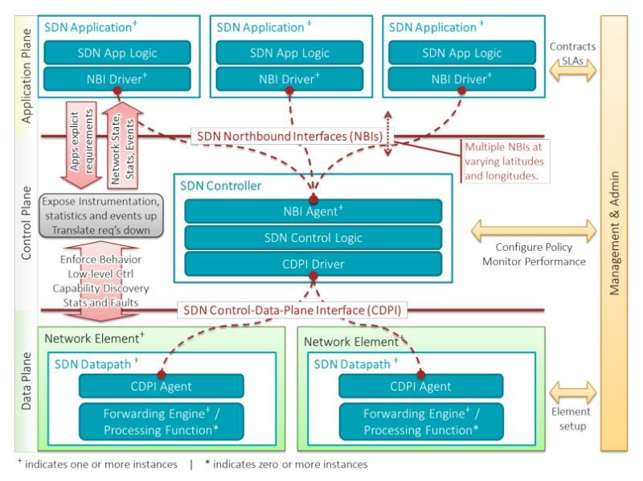

# Pengantar SDN

*Aris Cahyadi Risdianto, Muhammad Arif & Eueung Mulyana*

Software Defined Network (SDN) adalah istilah yang merujuk pada konsep/paradigma baru dalam mendisain, mengelola dan mengimplementasikan jaringan, terutama untuk mendukung kebutuhan dan inovasi di bidang ini yg semakin lama semakin kompleks. Konsep dasar SDN adalah dengan melakukan pemisahan eksplisit antara *control* dan *forwarding plane*, serta kemudian melakukan abstraksi sistem dan meng-isolasi kompleksitas yg ada pada komponen atau sub-sistem dengan mendefinisikan antar-muka (*interface*) yg standard.

Beberapa aspek penting dari SDN adalah :
1. Adanya pemisahan secara fisik/eksplisit antara *forwarding/data-plane* dan *control-plane*
2. Antarmuka standard (*vendor-agnosic*) untuk memprogram perangkat jaringan
3. *Control-plane* yang terpusat (secara logika) atau adanya sistem operasi jaringan yang mampu membentuk peta logika (*logical map*) dari seluruh jaringan dan kemudian  memrepresentasikannya melalui (sejenis) API (*Application Programming Interface*)
4. Virtualisasi dimana beberapa sistem operasi jaringan dapat mengkontrol bagian-bagian (*slices* atau *substrates*) dari perangkat yang sama.

##Mengapa SDN?
Sebelumnya telah disinggung tentang inovasi. Dalam hal ini terkait dengan kebutuhan inovasi untuk bidang jaringan yg semakin kompleks.

Termasuk diantaranya adalah fakta-fakta dan kebutuhan berikut:
1. **Virtualisasi** dan **Cloud**: Komponen dan entitas jaringan hybrid - antara fisik *bare metal* dan yg virtual
2. **Orchestration** dan **Scalability**: Kemampuan untuk mengatur dan mengelola ribuan perangkat melalui sebuah *point of management*
3. **Programmability** dan **Automation**: Kemampuan untuk mengubah *behaviour* (perilaku) jaringan serta untuk dapat melakukan perubahan terebut secara otomatis (sebagai contoh adalah kemampuan *troubleshooting*, perubahan *policy* dan lain-lain)
4. **Visibility**: Kemampuan untuk dapat memonitor jaringan, baik dari sisi sumber daya, konektivitas dan lain-lain.
5. **Kinerja**: Kemampuan untuk memaksimalkan penggunaan perangkat jaringan, misalnya optimasi bandwidth, load balancing, *traffic engineering* dan lain-lain (berhubungan dengan Programmability dan Scalability)

##Arsitektur SDN
Dalam konsep SDN, tersedia *open interface* yg memungkinkan sebuah entitas software/aplikasi untuk mengendalikan konektivitas yg disediakan oleh sejumlah sumber-daya jaringan, mengendalikan aliran trafik yg melewatinya serta melakukan inspeksi terhadap atau memodifikasi trafik tersebut.

Gambar berikut menunjukan arsitektur SDN beserta komponen dan interaksinya.

Arsitektur SDN dapat dilihat sebagai 3 lapis/bidang:
- **infrastruktur** (*data-plane* / *infrastructure layer*): terdiri dari elemen jaringan yg dapat mengatur *SDN Datapath* sesuai dengan instruksi yg diberikan melalui *Control-Data-Plane Interface* (CDPI)
- **kontrol** (*control plane / layer*): entitas kontrol (*SDN Controller*) mentranslasikan kebutuhan aplikasi dengan infrastruktur dengan memberikan instruksi yg sesuai untuk *SDN Datapath* serta memberikan informasi yg relevan dan dibutuhkan oleh *SDN Application*
- **aplikasi** (*application plane / layer*): berada pada lapis teratas, berkomunikasi dengan sistem via *NorthBound Interface* (NBI)

Bidang **Management & Admin** bertanggung-jawab dalam: inisiasi elemen jaringan, memasangkan *SDN Datapath* dengan *SDN Controller*, atau menkonfigurasi cakupan (*coverage*) dari *SDN Controller* dan *SDN App*.

Arsitektur SDN spt dijelaskan di atas, dapat berjalan paralel dengan jaringan non-SDN, fitur yg sangat berguna untuk migrasi secara bertahap menuju jaringan SDN.

##Abstraksi Jaringan
Konsep *layer* (lapis enkapsulasi) merupakan contoh dan satu-satunya abstraksi jaringan sebelum era SDN. Konsep *layer* ini juga hanya terbatas meng-abstraksi-kan *data-plane*: tidak ada konsep serupa untuk *control-plane*. Setiap kebutuhan baru untuk kontrol jaringan, dilakukan melalui mekanisme (protokol). Tidak ada yg salah dengan hal ini, selama kita mampu mengelola kompleksitas (*mastering complexity*).

Walaupun demikian, dengan cara ini, semakin lama akan semakin banyak mekanisme (protokol) yg menyebabkan jaringan berkembang semakin kompleks dan tidak mudah untuk dikelola. Dalam jangka panjang, kompleksitas akan menghalangi (atau setidaknya, memperlambat) inovasi.

> we must then shift our attention from **mastering complexity** to **extracting simplicity**... [Shenker, 2011]

Yg terakhir merujuk pada proses pemodelan dan *abstraksi* bidang kontrol jaringan. Menurut Shenker, *SDN control plane* memerlukan setidaknya 3 jenis abstraksi (SDN v1 & v2) :
1. **Forwarding Abstraction** : bertujuan untuk menjadikan mekanisme forwarding yg *fleksibel* dan tidak bergantung pada jenis perangkat (*vendor neutrality*).
2. State **Distribution Abstraction** : bertujuan untuk medapatkan *global network view* dan menangani semua proses *state dissemination/collection*. Abstraksi ini dilakukan oleh NOS (*Network Operating System*) yg merupakan sistem terdistribusi, berkomunikasi dengan elemen jaringan untuk membuat *network view*.  Aplikasi/*control-program* menggunakan *network-view* ini untuk menghasilkan konfigurasi setiap elemen jaringan.
3. **Specification Abstraction** : bertujuan untuk mendapatkan *abstract network view* yg merupakan fungsi dari *global network view*. Abstraksi ini dilakukan oleh *Network Hypervisor* (Nypervisor) yg menterjemahkan *abstract* ke *global network view*. Dengan Nypervisor, aplikasi/*control-program* dapat berinteraksi dengan jaringan seolah-olah seperti *single-device*.

Dalam istilah Shenker, SDN v1 adalah gabungan antara NOS dengan abstraksi *forwarding*. SDN v2 sudah termasuk *Network Hypervisor*.

##SDN dan OpenFlow
Sering ada yg keliru beranggapan bahwa OpenFlow (OF) adalah sinonim SDN. OpenFlow hanya merupakan salah satu komponen dari arsitektur SDN. OF merupakan pionir standard terbuka untuk protokol komunikasi antara *control* dan *forwarding plane* (i.e. *Southbound* APIs).

##Penutup
Beberapa hal yg perlu diingat:
- SDN *bukan* (tidak terkait langsung dengan) mekanisme/protokol komunikasi baru! Dengan kata lain, SDN kompatibel dengan teknologi yg sudah ada e.g. MPLS (forwarding), OSPF (state distribution), BGP (operator control) dll.
- Bicara tentang SDN, lebih terkait dengan modularitas dan fleksibilitas; terutama karena membawa kultur *modular programming* ke dunia *networking*
- Dengan SDN, *network engineer/scientist* dapat membuat fungsionalitas yg lebih kompleks secara lebih mudah, cepat dan handal, tanpa harus meng-*invent* atau mengoperasikan protokol komunikasi baru
- Abstraksi diperlukan untuk memilih fokus; dengan abstraksi setiap *challenges* (fungsionalitas) menjadi modular dan mudah ditelusuri
- Abstraksi adalah fundamental, sedangkan implementasi SDN adalah *ephemeral* (termasuk OF, controller dll.)
- Aplikasi dikembangkan di atas abstraksi (model abstrak) jaringan
- Masa depan jaringan terletak pada abstraksi yg tepat (*cleaner abstraction*), bukan *melulu* dengan membuat protokol terdistribusi yg kompleks
- Berkaca dari (r)evolusi sistem operasi, konsep SDN akan terus berkembang, untuk menemukan abstraksi yg tepat, efisien dan sederhana (*make it work, then make it simple*)

##Referensi

1. [SDN Architecture Overview](https://www.opennetworking.org/images/stories/downloads/sdn-resources/technical-reports/SDN-architecture-overview-1.0.pdf), Open Networking Foundation ONF, December, 2013
2. [The Future of Networking, and the Past of Protocols ](http://www.opennetsummit.org/archives/oct11/shenker-tue.pdf), Scott Shenker, 2011

##Lisensi
*CC Attribution-NonCommercial-NoDerivatives*
[(Lisensi)](http://creativecommons.org/licenses/by-nc-nd/4.0/)
