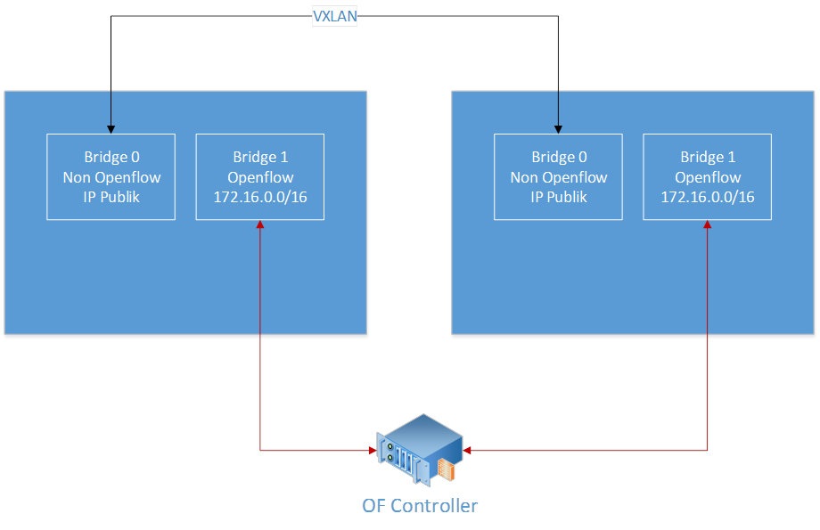
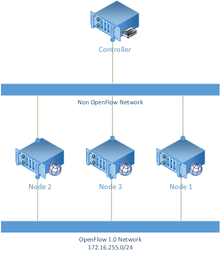
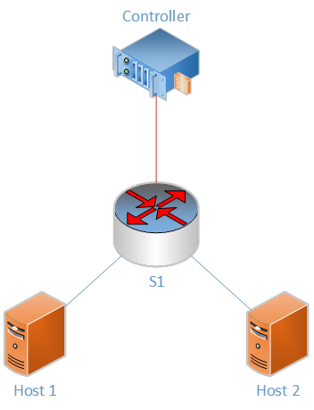

# Testbed OF@ITB

*Pories Ediansyah H & Affan Basalamah*

##Pendahuluan
Tujuan utama
- Menyediakan testbed untuk penelitian openflow ITB
- Untuk pribadi, sebagai network openflow dengan mensimulasikan network kampus ganesha ITB

Fitur yang harus dimiliki testbed
- Peneliti dapat melakukan penambahan atau pemanjangan jaringan
- Peneliti dapat mendesain topologi sendiri tanpa mengganggu peneliti lain
- Peneliti dapat menggunakan openflow versi 1.0 hingga versi 1.4
- Peneliti dapat mengontrol trafik menggunakan controllernya sendiri

##Komponen
3 Node switch :
- Menggunakan kernel linux debian versi 3.10
- Terdapat VM management menggunakan proxmox
- Routing menggunakan quagga
- Openflow switch menggunakan OpenVSwitch v2.3.0
- Support openflow 1.0 hingga 1.4

1 Controller :
- Menggunakan OS CentOS 6.5
- Integrated framework java 1.7, Python 2.6, Perl 5.10
- Controller openflow Ryu, Beacon, Opendaylight Service Provider, dan Floodlight

##Komponen (Detil)
Server Node 1 (PAU)
- CPU : Xeon 3.47GHz @ 4 core
- RAM : 8GB DDR3
- Disk : 128 GB

Server Node 2 (Labtek 8)
- CPU : Xeon 3.10GHz @ 4 core
- RAM : 8GB DDR3
- Disk : 1 TB

Server Node 3 (Labtek 5)
- CPU : Xeon 2.20GHz @ 4 core
- RAM : 8GB DDR3
- Disk : 128 GB

Server Controller (Labtek 5)
- CPU : Xeon 2.20GHz @ 2 core
- RAM : 4GB DDR3
- Disk : 40 GB

##Arsitektur
Umum
- Terhubung dgn tunnel vxlan melalui IP publik
- Pemisahan path controller dan openflow switch
- Per-Node memiliki kemampuan untuk membuat VM untuk memperpanjang networknya
- Routing antar node menggunakan protocol routing OSPF

Arsitektur - Per-Node

Deskripsi Topologi 1
- Digunakan untuk mempelajari software openflow switch (openvswitch) dan openflow controller
- Topologi ini dapat digunakan untuk menyederhanakan permasalahan yang ada di openflow

Topologi - *Logical*

##Eksperimen
Pengenalan OF
- Researcher dapat membuat openflow switch tersendiri
- Setiap interface openflow dapat mensetting controller sendiri-sendiri (1 interface, 1 controller)
- OF Controller dapat di install berbagai macam software controller

Penggunaan CLI
- User dapat membuat interface openflow dengan cara :
  - Jalankan perintah `ovs-vsctl add-br [interface_OF]`
  - Menambahkan port dengan cara `ovs-vsctl add-port [interface_OF] [port_OF]`
  - Contoh penggunaan ada di startup system yang berada di `/etc/network/interfaces` dimana ovs_options merupakan command ovs-vsctl dalam script startup
- User dapat mensetting OF controller dengan cara :
  - Jalankan perintah `ovs-vsctl set-controller [interface_OF] tcp:[IP_controller]:[Port_Controller]`
Contoh penggunaan ada di `/etc/rc.local`

Topologi - *Switching*

Topologi - *Routing*

##Lisensi
*CC Attribution-NonCommercial-NoDerivatives*
[(Lisensi)](http://creativecommons.org/licenses/by-nc-nd/4.0/)
